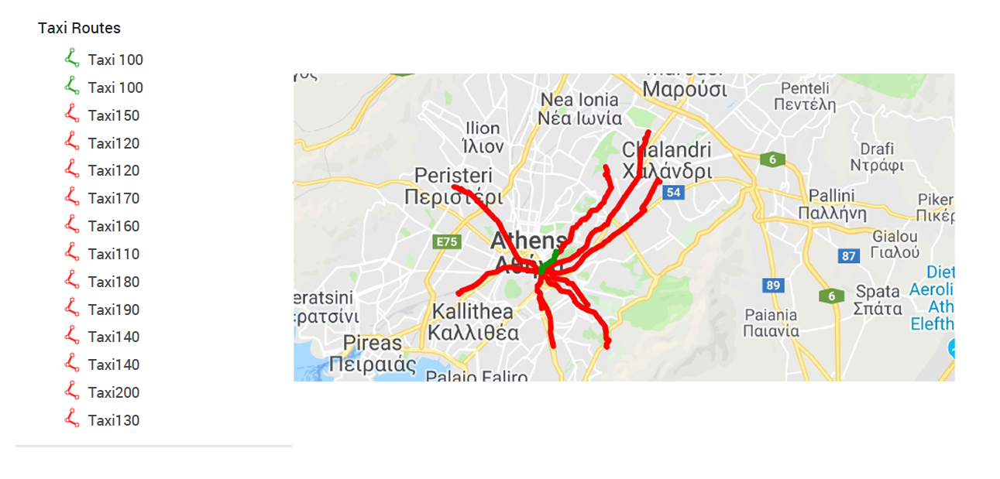

# Artificial Intelligence: Navigation system using A* algorithm
This repository hosts the programming exercise for the Artificial Intelligence course of NTUA.

## About the project
The goal of this project was to implement a Taxi Navigation System using A star search algorithm. This system will take as input the location (coordinates) of a client and it will output the best route for each of the taxis. In addition, it will inform the taxi driver that is closest to the client and show him all the alternative best routes to reach him. 

## Data
We were given three csv files as input data. All of these files contain coordinates for the city of Athens. 
- **client.csv**: this file contains the location (coordinates) of the client
- **taxis.csv**: this file contains the locations (coordinates) of all the taxis in the system and their ids.
- **nodes.csv**: this file contains nodes from which a taxi has to pass through while being on that road. Each road has an id, such as nodes on the same road have the same id.

## Output
Our system creates kml files that contain the best route for each taxi. We can upload them to [MyMaps](https://www.google.com/maps/d/u/0/) for visualization. 

i.g.,

In the example above, the green routes are the best. So the system informs **Taxi 100** to go to the client.
